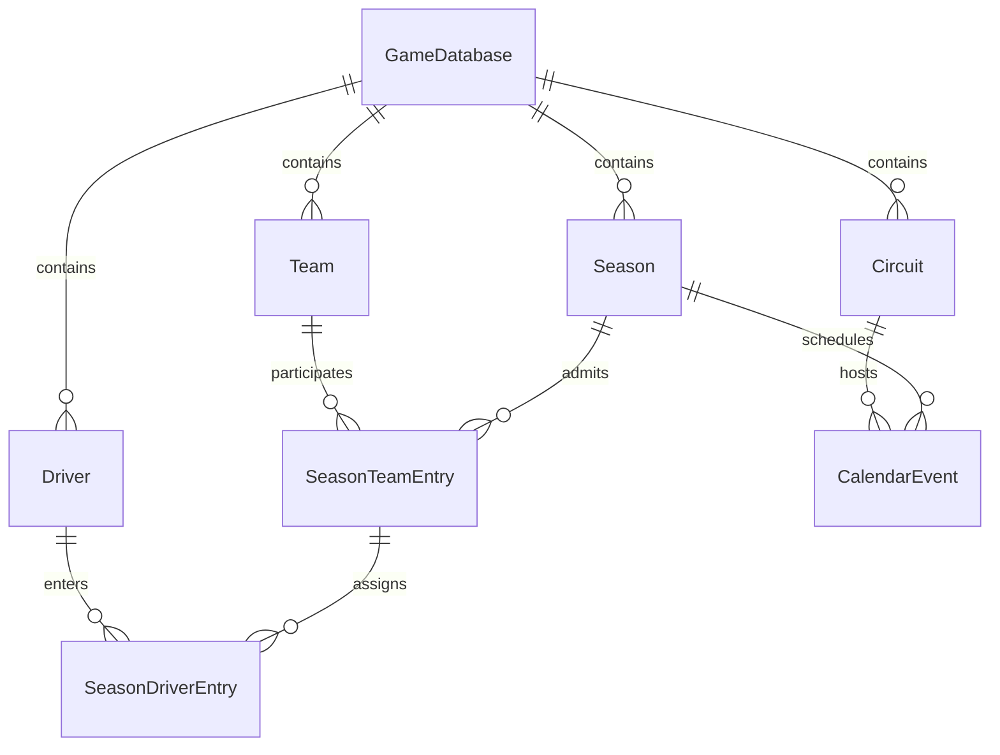

# Architecture

## Layers

- **UI — `src/app`, `src/components`:** App Router pages compose dependencies and render data. Server Components are the default. The translated shell and dashboard view, locale selector, and retry error boundary use client interaction. Tailwind is enabled; shared CSS tokens and component classes keep the small shell consistent.
- **Features — `src/features`:** Application orchestration and repository contracts. `getDashboard` validates requested IDs, calls its injected repository and preserves absent records as null. It does not import the adapter.
- **Domain — `src/game/domain`:** Readonly identities, ID validation and ID-based assignment logic. No React, Next.js or persistence dependencies.
- **Simulation — `src/simulation/core`:** Pure clock transition and injected `RandomSource` contract, runnable in isolation. No timing loop or race model.
- **Data/persistence — `src/data`:** Centralized temporary fixtures and a development adapter implementing the feature-owned port. A PostgreSQL/Prisma content adapter now operates behind its own domain repository port, while the standalone dashboard adapter is preserved.
- **Configuration — `src/lib/config.ts`:** Application version only; translated names and phase labels belong in the interface catalogs. No speculative sporting rules or tuning parameters.

The request flow is UI → feature → repository port → adapter. Features may later coordinate domain rules and simulation, then persist results. The engine must not call persistence directly: the conceptual layer order is not a requirement for database-dependent physics.

## Important rules

1. Simulation logic must not live in React.
2. Game logic must not depend on real-world names; behavior comes from structured attributes.
3. Entities and relationships use IDs. Names remain editable presentation data.
4. Development data remains centralized in `data/seed`; no scattered UI fixtures.
5. Simulation should be deterministic where practical: pass explicit state and an injected random source. Never use ambient time or `Math.random` in the engine.
6. Implement features incrementally, without placeholder gameplay or speculative systems.
7. Keep database content and the game engine separate. Map persistence records to domain types at adapter boundaries.

ESLint restricts framework, UI, feature and persistence imports in domain/simulation modules and disallows direct `Math.random`. These checks support code review; they are not a full transitive dependency checker.

## Contracts and failure handling

IDs are opaque non-empty strings without surrounding whitespace, not restricted to a database-specific format. Unknown valid IDs return absent data; malformed IDs throw understandable errors. Feature errors propagate to the Next.js error boundary, which logs the failure and offers retry. No swallowed errors or logging framework. Missing URLs render a 404. Future navigation is non-interactive and marked planned.

Clock states are readonly; advancing returns a new object. Negative, fractional, non-finite and overflowing ticks fail. The optional seeded random adapter uses a simple versioned 32-bit LCG and accepts unsigned 32-bit seeds; outputs lie in [0,1). Same seed and draw order reproduce a sequence. It is a foundation example, not a finalized race probability model. Future saves/replays must version the algorithm and preserve random state/draw order before resumable simulation is implemented.

## Future organization (not implemented)

Career → Season → Race Weekend → Practice → Qualifying → Race → Championship Update

Add feature folders for career, teams, drivers, cars, calendar and championship only when they contain real functionality. Add `game/rules`, `game/services`, and simulation modules for sessions, tyres, weather and strategy as those systems are designed. Add generic types/utilities only when they have actual shared users.

Core PostgreSQL/Prisma source-content modeling is implemented in Phase 2 below. Authentication, multiplayer, driver ratings/contracts/development, staff, car development/research, finances/sponsors/facilities/board expectations, all racing and session systems, fuel/ERS/tyres/weather/pits/overtaking/incidents/safety cars/red flags, 2D rendering and database editing remain deliberately unimplemented. No workers, sockets, infrastructure orchestration or complex state machines are introduced.

## Interface internationalisation

`src/i18n/en/messages.json` and `src/i18n/zh-TW/messages.json` hold namespaced interface keys. `catalog.ts` derives TypeScript keys from English and registers supported locales; missing/blank messages fall back to English, then to the visible key. The two catalogs are checked for matching keys and interpolation placeholders. Add a catalog, register its native language label and import it into the catalog map to add a language. No additional runtime library is needed for this foundation; a dedicated ICU library can replace this boundary if pluralization or rich text becomes necessary.

The shell and dashboard display are Client Components because changing language is interactive. The route remains a Server Component and fetches data through the application query before passing serializable data to the view. Locale context wraps the UI, not the domain or simulation. Their ESLint import restrictions include i18n modules. The selector never reloads the route or modifies game data.

`locale-store.ts` persists only `formula-operations.locale`. React's `useSyncExternalStore` provides an English server/hydration snapshot and restores the browser preference on subscription (see [React's server rendering guidance](https://react.dev/reference/react/useSyncExternalStore#adding-support-for-server-rendering)). Thus a stored Chinese preference may briefly show English before hydration; there is no hydration mismatch or server access to localStorage. The HTML `lang`, document title and description follow the selected locale after hydration. Account preferences and server/cookie negotiation remain deferred. Unavailable storage preserves the choice in memory and displays a translated warning; invalid stored locales safely default to English. Storage events synchronize other open tabs.

Entity names and identifiers are not interface translations. Development team/event/circuit names stay in the data module. Event dates are represented as an ISO date string or null, rather than an English status sentence. Later, an entity may carry an optional language-tag-to-string map alongside its canonical name; resolve it only in presentation, with canonical-name fallback. Keep that map in game/database data, never in the UI catalog, and do not import the interface Locale type into domain models.

`createFormatters` wraps Intl.NumberFormat and Intl.DateTimeFormat for numbers, currencies, percentages and dates. Dates default to UTC for stable server/client output and accept an explicit time-zone override. Keep raw numeric/time values in game state. Future race durations should get their own presentation formatter (using Intl.DurationFormat when appropriate, with an explicit precision/unit contract); no racing/time-calculation system is implemented here. Locale must never affect simulation behavior or saved numeric values.

## Phase 2 — reusable Game Database content

A `GameDatabase` is a reusable editable source dataset, not a running game or Career. It owns Teams, Drivers, Circuits and Season definitions. Multiple seasons may coexist within one dataset. `version` is content metadata; `schemaVersion` is a positive import-compatibility marker. The dataset key is globally unique; parallel versions can use separate keys until explicit version management is designed.

### Entities, identity and relationships

- `GameDatabase`: stable UUID and machine key, editable name/description, content/schema versions, built-in flag, audit timestamps.
- `Team`: identity, colours, country code and optional founding year. No finances or performance.
- `Driver`: independent identity, birthdate, nationality and optional preferred number. There is **no permanent teamId**.
- `Circuit`: calendar metadata, country/city, length and default lap count. No physics parameters.
- `Season`: named year definition, not a live championship state.
- `SeasonTeamEntry`: a Team participating in a Season, with explicit display order.
- `SeasonDriverEntry`: a Driver's initial assignment to a participating season Team, role and optional number. Race drivers require a positive number; reserves may have no number. Non-null numbers are unique per season across both roles.
- `CalendarEvent`: weekend dates, round and event display name, linked by ID to its Season and Circuit. No redundant circuit name or session models.

**ID = relational identity; key = stable database/import identifier; name = editable display data.** Persisted IDs use canonical UUID strings. The earlier generic `EntityId` remains an opaque string for compatibility with the standalone UI fixtures. New content repository methods reject non-UUID IDs before querying. The earlier `DriverAssignment` is only a generic assignment utility, not a Driver field; persisted assignments use `SeasonDriverEntry`.



### Dataset isolation and integrity

All content belongs to a `gameDatabaseId`. Parent models expose unique `(gameDatabaseId, id)` pairs. Season-team links reference both the season and team with those composite foreign keys. Driver entries reference `(gameDatabaseId, seasonId, teamId)` on `SeasonTeamEntry` and `(gameDatabaseId, driverId)` on Driver. This additionally requires the team to participate in that exact season. Calendar links likewise reference scoped seasons/circuits. Entry rows inherit dataset existence through these constraints rather than adding redundant direct GameDatabase relations. There is no application-only exception to relational dataset isolation.

Scoped entity keys are unique per dataset and entity type. Team membership/order, driver membership, non-null car numbers and event rounds are unique within a season. One entry per driver per season applies to both roles; mid-season transfers/multiple roles are intentionally unsupported. A driver can enter another team in another season without changing identity. Team size is not capped at two because sporting regulations are not part of this phase. Deletes/ID changes use RESTRICT, preserving references until an explicit deletion workflow is designed.

The generated migration `20260921000100_core_game_database` includes a clearly marked appended CHECK-constraint section. Prisma's schema DSL cannot express these checks: positive schema/year/order/round/length/lap/number values, nonempty display names, stable slug keys, uppercase two-letter country/nationality codes, hex colours, race-driver number presence, and end date ≥ start date. Dates are PostgreSQL DATE; audit timestamps are TIMESTAMPTZ. ISO country membership is not validated beyond code shape; a future editor can validate actual codes without a countries table. Event years/overlaps are not constrained to the season year, allowing cross-year definitions. No simulator depends on names or country codes.

### Repository and client boundary

`src/game/domain/content*.ts` contains readonly serializable content contracts, one focused `GameContentRepository` and lightweight seed-graph validation. `src/data/repositories/prisma-game-content.ts` implements:

- `getGameDatabaseById(id)`
- `getSeasonById(gameDatabaseId, id)`
- `listTeamsForSeason(gameDatabaseId, seasonId)` ordered by entryOrder
- `listDriversForSeason(gameDatabaseId, seasonId)` ordered by team entry, role, car number, then ID
- `listCalendarEvents(gameDatabaseId, seasonId)` ordered by round

Return values use ISO timestamp/date-only strings; Prisma types, Date objects and relation objects do not leak into domain contracts. Unknown entities return null; unknown/foreign seasons produce empty lists. Invalid IDs throw `InvalidContentIdError`. Persistence failures throw `ContentRepositoryError` with operation/cause and never return development fallback data. Error messages are diagnostic developer data, not untranslated UI; the existing translated error boundary remains the user-facing failure treatment.

`src/data/prisma/client.ts` is a server-only lazy singleton cached on globalThis for hot reload. `connection.ts` constructs dedicated clients for CLI/tests, reads PostgreSQL connection configuration, and honors the URL schema parameter in the pg adapter. `src/features/content/get-content-repository.ts` is the source-content server composition root and returns the domain interface. Components, app routes, i18n and ordinary features cannot import Prisma/pg/generated clients/adapters directly; ESLint tests exercise these boundaries. Domain and simulation retain stronger existing restrictions, including relative data and i18n imports. Generated client files are ignored, not source-maintained.

The dashboard deliberately remains on its original development adapter, without requiring PostgreSQL to preview the shell. It does not silently switch adapters, claim a Career exists or hide database outages. New persistence queries are available for subsequent application features and integration tests; no editor/API was introduced.

### Development seed and verification

`src/data/seed/content-development.ts` is the centralized private-use PostgreSQL development dataset: one database, Mercedes and Ferrari, George Russell/Kimi Antonelli/Charles Leclerc/Lewis Hamilton, Albert Park/Suzuka display identities, one 2026 season, two team entries, four race-driver entries and two weekends. It is separate from the existing standalone dashboard fixtures, whose regression contract is preserved.

The seed validates its complete graph and upserts fixed UUIDs in one transaction, in dependency order. Repeat runs restore canonical development values without deleting rows or duplicating IDs. Actual createdAt/updatedAt timestamps track persistence; reproducibility refers to stable IDs/content, not audit clocks. Treat seeded records as disposable examples: edit a copied dataset later. A conflicting database ID/key fails rather than overwriting a different root dataset. Unique-key conflicts or dependent-row conflicts roll back the transaction.

`npm test` runs offline domain, repository-mapping and boundary tests plus all prior regressions. Repository unit tests mock Prisma delegates and do not constitute SQL execution. `npm run test:db` requires TEST_DATABASE_URL and runs the actual migration/seed/read/constraint suite in a freshly named schema, deleting only that generated schema on teardown. It never defaults to DATABASE_URL or silently skips a missing database. PostgreSQL and schema-creation privileges are required. Do not claim database enforcement has been executed based on schema validation alone.

The Prisma CLI/client/pg adapter are pinned together at stable 7.10.0. The CLI latest tag resolved to an 8.0 prerelease during setup, which was deliberately not retained. Two scoped dependency overrides update Prisma CLI's deepmerge-ts to 8.0.2 and mysql2 to 3.24.4 to resolve their reported audit advisories; no MySQL infrastructure is used. Re-evaluate those overrides when upgrading Prisma. Format, validate, generate and full checks are required after dependency changes.

### Career separation, editing and future work

**A Career must not directly behave as a live mutable view of its source Game Database.** Editing source content must not rewrite an existing Career. Phase 3 implements the explicit clone strategy described below.

A future editor can change team/driver names, nationalities, season rosters, circuits, calendars and team colours through validated persistence without touching simulation code. Optional localized entity display names belong to game content, with language-tag maps and canonical-name fallback; they are not UI catalog entries and remain unimplemented. UI translation catalogs stay separate from source content.

Championship results/scoring can later reference Season, SeasonDriverEntry, SeasonTeamEntry and CalendarEvent, or their Career-specific copies, without making display names identity. Live Career-specific results must not be written into mutable source definitions. Detailed sessions, transfers, contracts, ratings, car models, finances, simulation, scoring, editor/import/export UI, authentication and multiplayer remain deferred.

## Phase 3 — independent persistent Career world

### Source content and snapshot rule

`GameDatabase` remains reusable source content. `Career` is the saved game: no duplicate SaveGame/SaveSlot model exists. Creation copies the selected season, its participating teams and drivers (including reserves), season team/driver entries, calendar events and only the circuits those events use. All display values become owned values; no later automatic synchronization occurs.

**Source GameDatabase changes after Career creation do not mutate existing Career state.** This includes names, colours, nationalities, circuit metadata, schedules, rosters and database version. Source IDs/version are scalar provenance, deliberately without foreign keys to source tables. Deleting source rows therefore cannot cascade into a Career, and historical provenance remains available after deletion. Source deletion itself still obeys the existing source-table RESTRICT constraints.

### Identity and transaction

`createCareer()` validates input and reads source content inside a single Prisma RepeatableRead transaction. The pure snapshot builder allocates fresh UUIDs and maintains explicit maps from source team/driver/circuit/season/entry IDs to Career IDs. Relationships never match on names or use source IDs. Selected source Team ID maps to the required Career.playerTeamId.

All eight tables are written in the same transaction. A failure rolls back every write. Composite foreign keys constrain relationships to the same Career and, for roster links, the same season. Scoped keys, driver assignments, car numbers, entry order and calendar rounds remain unique. The new migration adds PostgreSQL CHECK constraints alongside the Prisma-generated SQL.

Required root playerTeamId/currentSeasonId pointers create insertion cycles. Their composite foreign keys are DEFERRABLE INITIALLY DEFERRED, allowing root-first insertion while PostgreSQL validates both pointers at commit. Future migrations must preserve these deferrals and the custom checks; do not replace migrations with db push.

```text
GameDatabase + selected source Season
                | createCareer(): one transaction, fresh IDs
                v
Career = persistent save
  + CareerTeam / CareerDriver / CareerCircuit
  + CareerSeason
  + CareerSeasonTeamEntry / CareerSeasonDriverEntry
  + CareerCalendarEvent
```

### Domain, persistence and reads

`game/domain/career*.ts` holds serializable domain types, a focused repository port and pure snapshot construction. `features/career/create-career.ts` orchestrates the transaction through that port. `data/repositories/prisma-career.ts` implements persistence and maps database dates to ISO values; `features/career/server.ts` is the explicit server-only composition root. UI receives domain DTOs, never Prisma records.

Creation options query source data. Continue, listing and overview query only Career tables, including the current owned team/season and next incomplete event. Missing records are absent/404; storage failures produce translated errors, never fixture fallbacks or raw stack traces. The active Career is explicit in `/career/[careerId]`; there is no hidden global save selection.

### Dates, status, UI and future extension

Initial date is the earliest weekend start minus 14 UTC days (`PRESEASON_DAYS`). An empty calendar uses January 1 of the selected season year. Dates remain structured PostgreSQL DATE/ISO values. Career starts ACTIVE; its initial season and events start UPCOMING. Status transitions and time advancement are not implemented.

Career.currentSeasonId identifies the current owned season; its year is derived instead of duplicating currentSeasonYear. `/careers`, `/careers/new` and `/career/[careerId]` implement listing, validated creation and read-only overview. `/` stays an explicitly marked no-Career fixture preview. All interface text uses the English/Traditional Chinese catalogs and existing Intl formatters. Only language preference uses localStorage.

Later progression can add CareerSeason rows and update currentSeasonId transactionally. Contracts/transfers can reference CareerDriver and CareerTeam, with deliberate roster-history changes when designed. Car development and results should reference owned identities, never source rows. Source upgrades would require a separately designed explicit migration tool; automatic sync is forbidden. No future season generation, transfers, contracts, finances, racing, scoring, authentication or editor is implemented.

### Verification

109 offline tests preserve all 75 previous tests and add Career snapshot/service/adapter/boundary checks. The real PostgreSQL suites passed 40 tests (24 existing source tests plus 16 Career tests), including late-write rollback, independent worlds, source edits/deletion, remapping, persistence across clients and relational constraints. See the Phase 3 report for the execution environment and browser verification.

## Phase 4 — Career time and race weekend lifecycle

### Authoritative Career time

Career.currentDate remains the authoritative in-world date, stored as PostgreSQL DATE and serialized as ISO YYYY-MM-DD. Locale only formats it through UTC-based Intl utilities. Neither browser/system time nor circuit timezone selects a game date. Real createdAt/updatedAt/completedAt timestamps are audit data, separate from the timeline.

Entering an event sets currentDate to `max(currentDate, event.startDate)`; final session completion sets it to `max(currentDate, event.endDate)`. For ordinary non-overlapping calendars these are exactly the weekend start/end dates. The maximum prevents backward time for overlapping or out-of-order source calendars. Intermediate sessions do not advance game dates; detailed session dates/times are deferred.

### Event and weekend lifecycle

Existing CareerEventStatus.CURRENT is retained as the in-progress state: UPCOMING → CURRENT → COMPLETED. The next event is selected among current-season UPCOMING events by round, start date and ID. An active unfinished weekend blocks advancement. An explicit expected event ID prevents stale requests from entering a different round.

CareerRaceWeekend is lazily created when entering an event; its states are ACTIVE and COMPLETED. Absence represents not started, avoiding duplicate NOT_STARTED state. There is at most one weekend per event and one active weekend per Career. It references the owned event with a Career/season-scoped foreign key and does not duplicate event/circuit display metadata. currentSession is derived from the ordered persisted sessions rather than a redundant pointer.

Final session completion closes both weekend and event, records the deterministic end date and leaves the player in management progression. The next event does not start automatically. When no UPCOMING or CURRENT events remain, the read model exposes “Season calendar complete”; the Career remains ACTIVE and no future season is generated. Empty calendars use this same terminal calendar state.

### CareerSession and transition rules

`game/domain/progression.ts` owns the standard ordered definition: Practice 1, Practice 2, Practice 3, Qualifying, Race. Entry persists that sequence with first AVAILABLE, all others LOCKED. UI iterates the persisted list and receives permitted intent actions from domain logic; it does not unlock sessions itself.

AVAILABLE → IN_PROGRESS uses Start. IN_PROGRESS → COMPLETED uses the explicitly temporary development completion. Practice additionally permits AVAILABLE → COMPLETED via structural Simulate Practice, or AVAILABLE → SKIPPED. Completed/skipped practice unlocks the next session. Qualifying and Race cannot be skipped or simulated as practice. Prior required sessions must resolve before starting later sessions. Locked, already-completed, foreign and stale requests fail with domain errors. No arbitrary update-status API is exposed to UI.

Session uniqueness covers type and order per weekend. Composite foreign keys enforce Career ownership. PostgreSQL partial unique indexes additionally enforce one CURRENT event per Career, one ACTIVE weekend per Career and one AVAILABLE/IN_PROGRESS session per weekend. CHECK constraints enforce positive order, practice-only skipping and consistent timestamps. Ordering across rows and final-session rules are enforced by the application/domain transaction, not a complex SQL trigger system.

### Transactions and concurrency

The separate focused CareerProgressionRepository extends the existing persistence boundary without changing creation snapshots. `features/career/progression.ts` exposes advance/session intents; `server.ts` composes its Prisma adapter. Each transition uses a ReadCommitted transaction, first updating the Career audit timestamp to acquire its row lock. Subsequent reads therefore see the preceding request's committed state. Invalid requests roll back even that audit write. The lock serializes transitions per Career; unrelated Careers remain independent.

Entry commits Career date, weekend, all sessions and event status together. Final completion commits session, weekend, event and Career date together. The old active session is terminalized before the next is unlocked, respecting the partial unique index. DB uniqueness is a second defense against duplicate writes. No automatic retry converts a rejected stale request into another gameplay action.

### UI, translations and simulation boundary

`/career/[careerId]` shows factual completed-event totals, next event or active weekend/current session. `/career/[careerId]/events/[eventId]` renders owned event details, current Career date, sessions/statuses and allowed actions. Server actions return translated errors and revalidate affected pages. English and Traditional Chinese catalogs cover all new labels; language changes cannot mutate state. The full page-title effect also reapplies after server-action refreshes.

Development controls are visibly labelled and accompanied by a no-performance/no-results notice. They only prove lifecycle transitions; no sporting results or random placeholders are produced. They should be replaced or gated when real gameplay ships.

Future simulation state attaches to CareerSession. Lifecycle starts/closes it; the independent engine calculates performance. Practice can later persist setup/driver/tyre knowledge before completing its session. Qualifying can later persist Q1/Q2/Q3 and a grid. Race can later persist classification and championship updates before completion. None of these engines/results exist now. A future Sprint weekend can add a domain sequence/type discriminator and enum migration; React does not assume a permanent five-session format. No configuration editor is introduced.

## Phase 5 — deterministic free-air Race simulation

### Pure engine and lap model

`src/simulation/race` exposes createRace, calculateLapTime, advanceRaceLap, advanceRace, simulateRace and raceResult. It accepts serializable IDs and numeric profiles; it cannot import React, Next, Prisma or i18n, access browser storage, read the clock or call Math.random. Application services connect the pure engine to transactional storage; React only sends intents and renders DTOs. One step advances every entrant by one lap, not milliseconds or sectors.

Times are integer milliseconds. Each component is rounded before summation:

```text
lapMs = baselineMs
      + round((100 − carPerformance) / 100 × carPerformanceRangeMs)
      + round((100 − driverPace) / 100 × driverPerformanceRangeMs)
      + round(fuelMassKg × fuelEffectMsPerKg)
      + round(triangularNoise × consistencyAmplitudeMs)
```

Driver pace/consistency and car performance are bounded 0–100. Version-1 defaults use a 3000 ms whole-scale car penalty and 1500 ms driver penalty relative to rating 100. Thus ten car points cost 300 ms/lap and ten driver points cost 150 ms/lap. These are initial tuning assumptions, not validated real-world ratings. Consistency linearly controls a bounded amplitude from 350 ms at 0 to 30 ms at 100. Noise is the sum of two uniform draws minus one: triangular, symmetric and concentrated near zero. The minimum supported baseline is 1000 ms and maximum noise amplitude is 500 ms; calculated laps remain positive.

Fuel is represented at gram precision, exposed as kg in domain state and stored as integer grams. Each lap uses fuel at its start; remaining mass is max(0, initialGrams − completedLaps × burnGrams). Zero fuel does not cause retirement; running-out mechanics do not exist. Base profile defaults use 30 ms/kg. Entrants start at `(gridPosition − 1) × 180 ms`, a simple offset without launches/Turn 1 modelling.

Classification orders completed laps descending, elapsed time ascending, then stable entrant ID using codepoint comparison. Gaps/intervals are milliseconds; cross-lap gaps are null rather than misleading negative times. The synchronous lap model normally keeps all entrants on the same completed-lap count. Faster accumulated free-air time may reorder entrants, but this is not physical overtaking.

### Determinism, snapshots and versioning

The existing version-1 32-bit LCG now exposes getState while preserving RandomSource.next. Each lap draws twice per entrant in immutable grid order, not changing classification order. State includes the original seed, current RNG state, simulationVersion=1 and frozen input snapshot. Seed is generated once at application-level Race start, never on page load or resume. Unknown saved versions cannot advance. Formula/RNG changes must introduce a new version and an explicit compatibility decision; no save migration machinery exists yet.

The engine snapshots the input on creation and returns new entrant/state objects for lap transitions. Simulating continuously or serializing at lap 10, reopening and continuing lap 11 produces identical final state/results. Parameters, circuit baseline/fuel coefficient, driver pace/consistency, car performance, fuel amounts and grid are all saved so external content edits cannot change an ongoing Race.

### Temporary profile and grid source

`features/race/development-profiles.ts` centralizes temporary application inputs, separate from final driver/car systems. The owned current-season RACE_DRIVER roster is ordered by team entry order, car number and entry ID. Reserves are excluded. No qualifying result is fabricated. Driver pace starts at 92 and cycles down by 1.5 over six roster slots; consistency cycles 88/90/92/94. Car performance starts at 92 and drops 2 points per team-order bucket across eight buckets. Names and special IDs never affect performance.

Circuit baseline is lengthMeters / 60 m/s, rounded to milliseconds; the race distance uses the owned circuit defaultLapCount. Burn is 0.3 kg per kilometre rounded to grams, and starting fuel is burn × totalLaps. These are explicitly provisional defaults for testing any supported Career roster. Unsupported empty/oversized rosters or extreme profile inputs produce a translated validation error rather than silently fabricating data. The pure engine supports 1–100 entrants and 1–1000 laps with bounded numeric inputs; 20 entrants over 50–75 laps are covered by tests.

### Relational persistence and atomic lifecycle

CareerRaceSimulation owns metadata, version, seed/RNG state, current/total laps, status and numeric input parameters. CareerRaceEntrant owns one row per driver containing frozen performance/grid/name data and current/result state: laps, elapsed/last/best time, fuel, position, gap and interval. The finished rows are the final classification; there is no redundant result table and no opaque JSON world blob or lap telemetry store.

One simulation is allowed per CareerSession. A constant RACE sessionType CHECK plus a composite `(careerId, sessionId, type)` foreign key prevents even direct SQL from attaching a simulation to a non-Race session. Composite entrant references constrain simulation, team and driver to the same Career. Seed/RNG storage uses BIGINT for the full unsigned 32-bit range, converted to exact numbers in DTOs. CHECK constraints enforce bounds and valid running/finished metadata.

`CareerRaceRepository` reads through RepeatableRead transactions and changes through ReadCommitted transactions with the same per-Career row lock used by progression. Start commits input snapshots and session IN_PROGRESS together. Advance persists one/five/all remaining laps. Each request includes expectedLap, so concurrent duplicates cannot accidentally advance twice. Final result, Race FINISHED, session/weekend/event completion and Career date commit together or roll back together. SQL integration tests inject late failures in both start and finish.

The production browser scaffolding action now excludes RACE; its UI links to the engine page. The original low-level transition helper remains for the existing Phase 4 regression harness and legacy structural saves. Once a real running simulation exists, the progression repository additionally rejects attempts to complete its session through that helper. Race service finalization uses the shared lifecycle function only after the engine has finished. Legacy already-completed development Race sessions display an explanatory no-classification state rather than invented results. Legacy IN_PROGRESS Race sessions without a simulation may start one.

### UI and limitations

`/career/[careerId]/events/[eventId]/race` provides Start Race, Advance 1 Lap, Advance 5 Laps and Simulate to Finish. Its basic development timing table shows classification, elapsed/gap/interval/last/best times and fuel. Results remain readable after completion/refresh. English and Traditional Chinese use centralized labels; Intl-based duration/gap helpers live outside simulation. Language preference never enters engine input or persistence mutations.

**Phase 5 models free-air race pace and accumulated race time, not track-position interaction.** No tyres, traffic/overtaking, pit stops, DRS/ERS, weather, failures, incidents, commands, points, practice/qualifying engine, real-time speed controls or 2D viewer are implemented. All entrants finish. Later engines can extend versioned input/state at the simulation boundary without moving calculations into UI or repositories.

## Phase 6 — tyre-enabled simulation (current)

The Phase-5 descriptions above are historical v1 behavior. New UI starts use version 2 and `src/simulation/race/tyres`; old saves continue as v1 without invented tyres. The original start service remains callable for v1 compatibility. No React, Prisma, Next, locale, browser or wall-clock dependency enters the tyre engine.

### Model and units

Profiles define compound grip, operating windows, temperature targets/response, wear gain and piecewise degradation. Wear is consumed permille (0 fresh, 1000 maximum); age is integer laps; temperature is milliC. Soft has stronger fresh grip and faster wear; Hard has slower fresh grip and longer life. Small early linear loss progresses to quadratic degradation and a steeper quadratic cliff. All values are provisional game tuning.

The frozen tyre config carries numeric circuit stress/energy (development defaults 1000 permille), independent of track names. Temperature begins at 80°C, moves gradually toward a dry compound/energy target and adds a capped penalty outside its operating window. Wear and temperature coupling is deliberately limited. See [Phase-6 report](phase-6-report.md) for exact constants, measurements and tests.

### Ordering, snapshots and resume

Each lap reads current fuel/tyres, calculates pace with the unchanged two consistency draws per entrant, updates timing, burns fuel, advances age/wear/temperature, then classifies. Tyres add no randomness. State updates are immutable. V2 starting tyres and all three profiles are deep snapshots. Persisted actual current tyre values are reloaded, never recomputed from lap count.

The additive fifth migration stores nullable legacy-compatible starting/current tyre columns and owned relational profile snapshots. CHECKs bound wear, temperature, age, stress and profiles; enum values limit compounds to dry tyres. Existing composite ownership and atomic lifecycle transactions remain. A single stint number/start marker allows later replacement without adding stint history now.

### Presentation and limitations

Starting compound selectors disappear after start. Table columns show tyre, age, consumed wear percentage and Intl-formatted temperature, translated in English/Traditional Chinese. Locale never enters the simulation snapshot. No pit stops, wet tyres, traffic, sets, driver tyre-management attribute or pace commands exist. Worn tyres stay on the car for the full race and may reach severe degradation; they do not puncture or reset.

## Phase 7 — explicit track interaction (current)

The preceding phase sections describe historical rules. All new browser races now call `startTrafficCareerRace` and create v3. Existing v1/v2 input/state stays under its original rules, with captured result fixtures preventing silent reinterpretation.

### Track order and crossing checkpoints

`simulation/race/traffic` separates raw potential pace from actual race time. It keeps an explicit ordered array, backed by persisted position. All potential laps are computed in grid order; traffic then constrains next-lap crossing times to that physical order. Only a successful adjacent attempt swaps entries. A blocked follower pays the delay in actual elapsed/last/best times. Final classification follows the constrained final-lap crossings and is immutable after completion.

This is a whole-lap checkpoint abstraction, without sectors or simultaneous geometry. Completed crossings and signed leader-relative `progressMicrolaps` (millionths of a lap, approximated from baseline crossing delay) are separate persisted values. BIGINT accommodates the distance range. The current batch engine advances every entrant's next crossing together; detailed partial-lap finishes and blue-flag encounters are deferred. Per-entrant lap counts and null cross-lap intervals remain available for future extension.

### Dirty air, attacks and DRS

Start-checkpoint same-lap gaps determine dirty air and DRS. Dirty air begins within 1500 ms, scales linearly with proximity and numeric circuit sensitivity, and adds at most 300 ms at default sensitivity. It does not modify tyres. DRS defaults to lap 3, a 1000 ms detection threshold and two numeric zones giving 80 ms each (capped at 300 ms); it also strengthens attacks. Multiple followers may qualify. A leader has no target.

Every second lap, front-to-back disjoint pairs may contest if projected gap is at most 300 ms and effective pace advantage at least 100 ms. Resolution uses pace, temporary overtaking/defending ratings, car difference, circuit difficulty, DRS and a bounded seeded probability. Success explicitly swaps order; failure preserves a minimum 80 ms gap. A car participates in at most one contest per lap. Structured attempt diagnostics are transient; current flags/counters are persisted without an event-history system.

### Determinism and storage

The original two consistency draws per entrant occur first in fixed grid order. Then one extra draw occurs for each eligible contest in front-to-back order, including zero-probability contests. Ineligible pairs consume none. The saved RNG state resumes exactly. Tyre/fuel calculations remain unchanged and independent of presentation.

The sixth migration adds an owned relational configuration snapshot, driver ratings and current track/DRS/diagnostic fields. Positions are unique per simulation with a **DEFERRABLE INITIALLY DEFERRED** constraint, allowing atomic swaps while rejecting duplicate final positions. Preserve the deferred timing when evolving schema. Existing Career locks/transactions protect all state and lifecycle writes. Old rows retain NULL interaction fields. Reads use saved positions, never historical inference from elapsed times.

### UI and limitations

English/Traditional Chinese development columns show last-lap DRS, overtake count and blocked milliseconds. The indicator reports detection during the completed lap, so a car that passed into the lead can still show that lap's DRS. Locale never enters configuration or state transitions.

No pits, strategy commands, ERS, weather, incidents or blue flags are implemented. See [Phase-7 report](phase-7-report.md) for probability details, numeric measurements, exact test counts and browser evidence.

## Phase 8 — pit strategy (current)

New browser races use `startPitCareerRace` and version 4. Historical sections above describe earlier versions; v1/v2/v3 input and state continue under their original rules. A v3 result fixture captured before this change joins the older regression fixtures.

### Lifecycle and pit-lap semantics

A pending request at checkpoint 15 commits with the next advance, executes after lap 16, and starts the new tyre stint on lap 17. The request can be changed or cancelled before commitment. Service/rejoin completes within the same atomic step; there is no partially saved PITTING status. Commands are rejected if already finished or if the next crossing is the final lap.

`simulation/race/pits` owns immutable request and service mechanics. Configuration snapshots transit loss, stationary base/variation, new-tyre temperature and simulation-critical AI settings. Each completed stop closes the old stint after normal tyre/fuel advancement, adds loss, resets age/wear, fits the chosen compound and opens a new stint. Fuel is not refilled.

### Order and determinism

Committed cars take a separate modeled pit route and are excluded from normal dirty-air/DRS/attack resolution on that lap. Non-pitting cars retain the existing explicit order resolver. Pit crossing times are merged back into that constrained order, with stable original-grid tie-breaking and the minimum following gap. Only pit-route entries can move through this merge; pit-cycle changes do not increment on-track overtakes. Following-lap interactions use the rejoin gaps.

Potential-lap RNG draws still occur in grid order first, then on-track attempt draws, then one service draw per stop in original grid order (including zero-variation stops). Commands and policy/estimate calculations use no randomness. Reload preserves actual current state, frozen tuning, pending request, revisions and global RNG.

### Histories and transactions

The seventh additive migration introduces `CareerRacePitProfile`, `CareerRaceStint` and `CareerRacePitStop`, with composite owned references and numeric constraints. Stint boundaries store actual starting/ending tyre state; active stints end with NULL until service or race completion. A partial unique index permits one open stint per entrant. Stop number/lap uniqueness prevents duplicates. Preserve this partial index and the existing deferred position uniqueness in future migrations.

Pending compound, controller, stop count and command revision live on the entrant. Legacy rows retain NULL fields. The adapter writes current state and all structured history in the same locked Career transaction as lifecycle changes. Expected lap plus expected command revision prevents conflicting Box/change/cancel commits. Application commands are restricted to the player's owned team. No formatted history strings or large telemetry blob is stored.

### Strategy and presentation

The separate temporary AI policy estimates tyre-only continuation versus fresh compounds once snapshotted wear/minimum-stint conditions are met, and requests a stop only when estimated saving exceeds normal nominal pit cost. It uses the same mechanics as player cars and predicts neither weather nor traffic. Undercut/overcut outcomes emerge from tyre pace, warm-up, pit cost and rejoin traffic; no strategy bonuses exist.

The application pit-window helper only estimates laps to the current tyre cliff. It is not authoritative state or an optimizer. English/Traditional Chinese panels provide manual requests/change/cancel, estimates and histories, with Intl units and no locale input to simulation. No final UI redesign, compulsory compound regulation, ERS, weather, incidents or double-stack queue simulation is included.

See [Phase-8 report](phase-8-report.md) for exact tuning, rejoin limitations, measured strategy scenarios, test counts and actual browser evidence.


## Phase 9 — current command architecture

New starts use simulation v5; v1–v4 keep their prior optional profiles and behaviours. `simulation/race/commands/model.ts` defines integer resource mechanics and versioned tuning, while `policy.ts` selects AI modes without RNG or private bonuses. Player team membership is enforced in intent-based application services; all three command types share an optimistic revision inside the existing Career transaction lock. Snapshot configuration resides in an owned command-profile row; commands and ERS reside on the existing owned entrant. No presentation locale enters simulation. See [Phase 9 report](phase-9-report.md) for exact processing order, exhaustion behaviour, defaults, SQL verification, balance measurements and limitations. Earlier architecture sections describe historical phases.


## Phase 10 — current weather architecture

New starts use v6. `simulation/race/weather/model.ts` owns frozen seeded truth/forecast profiles, persistent rainfall/water/temperatures/DRS and numeric tyre-water curves. Its generation RNG is separate from lap interaction RNG. `weather/policy.ts` receives current observations and the shared public forecast, with no hidden timeline. Weather modifies existing tyre thermal/wear inputs and potential pace before traffic; fuel/ERS and ordinary pit execution remain shared mechanics. An owned weather row persists the frozen profile and bounded current state atomically with the race. Version-aware SQL guards restrict wet compounds to v6 while prior migration/test files remain unchanged. The development UI uses central English/Traditional Chinese resources; no locale enters simulation. See [Phase 10 report](phase-10-report.md) for exact ordering, measurements, real SQL/browser checks and limitations. Earlier sections describe historical phases.


## Phase 11 — v7 incidents and Race Control

`simulation/race/incidents` owns the pure v7 lap path, numeric risk profiles, dedicated RNG and state validation. The existing engine dispatches only version 7 to it; v1–v6 retain the original lap path. New starts use `startIncidentCareerRace`; all historical start APIs remain available. Capture old-version fixtures before adding further simulation versions.

Reliability and control are frozen race inputs, separate from editable game content and translated UI. The six-draw original-grid incident schedule consumes draws even for retired/suppressed slots. Retirement is an end-of-lap state transition; resources and participation then freeze. Race clock completion retains the existing scheduled-lap contract even if no cars remain. Events are ordered structured data, translated by the client from centralized catalogs.

VSC/SC suppress overtaking and deployment; SC compresses excess adjacent gaps gradually. Resource/thermal modifiers cap actual effects without rewriting player commands. Effective pit loss compares a fixed pit route with the slowed field's time through the bypassed track section. AI receives that same cost. Restart DRS gating and weather gating both apply.

`CareerRaceIncidents` is a small owned extension: numeric control/RNG columns plus configuration, reliability, entrant-incident and event JSON. It shares the existing transaction and Career lock, with SQL ownership/check constraints and runtime semantic validation. It is not an event-sourced aggregate: current state remains authoritative and events provide history. The additive tenth migration preserves previous migration bytes and extends the wet-compound guard to v7.

See [Phase 11 report](phase-11-report.md) for exact draw semantics, bounds, measurements and verification. No final component allocation, red flags, unlapping, continuous collision geometry, 2D viewer or Practice/Qualifying engine is included.

## Phase 12: Race viewer

`features/race/viewer` presents the existing deterministic v7 checkpoint. Its application adapter dispatches typed intents to the existing Race services; those services retain expected-lap checks, command revisions, player ownership and PostgreSQL locking. React never writes Prisma rows or calculates Race outcomes. No simulation migration or v8 was introduced.

The desktop screen combines a timing tower, original SVG circuit and selected-driver controls. Weather and Race Control remain visible above them. Recent structured events are translated when displayed; stints and diagnostic details are expandable. AI and finished/retired driver panels are read-only. Two player shortcuts keep their original input order as classification changes.

### Circuit layout and positions

`data/seed/circuit-layouts.ts` stores normalized closed polylines keyed by stable source-circuit UUID. Both bundled shapes are original fictional schematics, including when their display names are Albert Park and Suzuka. Unknown/imported circuits receive a generic schematic. The declared direction describes the ordered point sequence; progress follows that sequence from the normalized start/finish offset. Display names never select layouts.

`viewer/model.ts` wraps absolute progress and interpolates by polyline arc length. Modern entrants use authoritative `progressMicrolaps`; legacy entrants use completed laps and elapsed-time gaps. The timing tower retains authoritative classification order, including retirements. Grid gains are labelled separately from overtakes. PIT comes from committed stop history.

A single requestAnimationFrame loop updates SVG transforms for all markers and labels between checkpoints. Retired cars snap to their last saved position. Labels are placed away from markers and each other at checkpoint destinations, then drawn above the marker layer. System reduced-motion and the local Reduce motion checkbox snap instead of animating. Strategic skip also snaps to avoid overlapping long animations during rapid checkpoint requests. Animation never writes Race state.

### Playback and viewer state

`PlaybackController` owns one timer and one in-flight mutation. After a committed response, the next request waits 2400 / speed milliseconds for 1×, 2×, 4× or 8×. Speed is never included in simulation inputs. An injectable clock makes cadence tests deterministic without mocking PostgreSQL timers.

Pause clears future requests. A request already committing may finish; it is not rolled back. Commands pause first and are disabled during a mutation. Expected-lap locking remains the server-side safeguard across tabs. Errors pause and ask the user to refresh the authoritative checkpoint.

Auto-pause detects player incidents/retirements/pit completion, control changes, weather/DRS bands and finish. Next strategic event requests one lap at a time, stops on these events even with auto-pause disabled, and is capped at 20 laps. Finish always stops playback. Refresh reconstructs positions from saved state and starts paused.

Selection, gap/interval, speed, auto-pause and motion settings are local viewer state and currently reset on refresh. Only language persists in browser storage. The locale cannot enter Race calculations or command payloads. v1–v6 render available state and hide unsupported command and tyre controls.

### Accessibility and limitations

Timing selectors and SVG markers are keyboard reachable; marker Enter/Space selects the driver. Buttons expose pressed state, selection has a ring/indicator, and race status uses text as well as colour. Tyre tokens include full-name tooltips. The tower scrolls vertically for 20 entrants; responsive controls use three columns on laptops and two on tablets before stacking at narrow widths.

The simulation remains lap-checkpoint based. Movement is bounded visual interpolation, not corner-by-corner physics or an official real-world circuit layout. Cars can overlap in close packs; callouts and authoritative timing resolve their identity/order. No live telemetry or new gameplay authority was added.

## Private-use source identity update

The source fixture uses the requested small real-life identity subset over unchanged development numeric profiles. IDs, old-looking internal keys, database identity, team colours, performance, distance/lap counts and simulation code remain stable. A new source-driver-ID ordering prevents display car-number changes from reassigning index-based provisional Race profiles. Frozen Race inputs remain untouched. Reseeding updates source rows; existing Careers retain their own snapshots. See the private-use naming report for metadata and scope.
