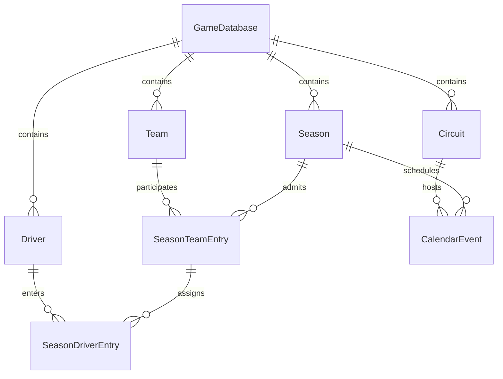

# Architecture

## Layers

- **UI — `src/app`, `src/components`:** App Router pages compose dependencies and render data. Server Components are the default. The translated shell and dashboard view, locale selector, and retry error boundary use client interaction. Tailwind is enabled; shared CSS tokens and component classes keep the small shell consistent.
- **Features — `src/features`:** Application orchestration and repository contracts. `getDashboard` validates requested IDs, calls its injected repository and preserves absent records as null. It does not import the adapter.
- **Domain — `src/game/domain`:** Readonly identities, ID validation and ID-based assignment logic. No React, Next.js or persistence dependencies.
- **Simulation — `src/simulation/core`:** Pure clock transition and injected `RandomSource` contract, runnable in isolation. No timing loop or race model.
- **Data/persistence — `src/data`:** Centralized temporary fixtures and a development adapter implementing the feature-owned port. A PostgreSQL/Prisma content adapter now operates behind its own domain repository port, while the standalone dashboard adapter is preserved.
- **Configuration — `src/lib/config.ts`:** Application version only; translated names and phase labels belong in the interface catalogs. No speculative sporting rules or tuning parameters.

The request flow is UI → feature → repository port → adapter. Features may later coordinate domain rules and simulation, then persist results. The engine must not call persistence directly: the conceptual layer order is not a requirement for database-dependent physics.

## Important rules

1. Simulation logic must not live in React.
2. Game logic must not depend on real-world names; behavior comes from structured attributes.
3. Entities and relationships use IDs. Names remain editable presentation data.
4. Development data remains centralized in `data/seed`; no scattered UI fixtures.
5. Simulation should be deterministic where practical: pass explicit state and an injected random source. Never use ambient time or `Math.random` in the engine.
6. Implement features incrementally, without placeholder gameplay or speculative systems.
7. Keep database content and the game engine separate. Map persistence records to domain types at adapter boundaries.

ESLint restricts framework, UI, feature and persistence imports in domain/simulation modules and disallows direct `Math.random`. These checks support code review; they are not a full transitive dependency checker.

## Contracts and failure handling

IDs are opaque non-empty strings without surrounding whitespace, not restricted to a database-specific format. Unknown valid IDs return absent data; malformed IDs throw understandable errors. Feature errors propagate to the Next.js error boundary, which logs the failure and offers retry. No swallowed errors or logging framework. Missing URLs render a 404. Future navigation is non-interactive and marked planned.

Clock states are readonly; advancing returns a new object. Negative, fractional, non-finite and overflowing ticks fail. The optional seeded random adapter uses a simple versioned 32-bit LCG and accepts unsigned 32-bit seeds; outputs lie in [0,1). Same seed and draw order reproduce a sequence. It is a foundation example, not a finalized race probability model. Future saves/replays must version the algorithm and preserve random state/draw order before resumable simulation is implemented.

## Future organization (not implemented)

Career → Season → Race Weekend → Practice → Qualifying → Race → Championship Update

Add feature folders for career, teams, drivers, cars, calendar and championship only when they contain real functionality. Add `game/rules`, `game/services`, and simulation modules for sessions, tyres, weather and strategy as those systems are designed. Add generic types/utilities only when they have actual shared users.

Core PostgreSQL/Prisma source-content modeling is implemented in Phase 2 below. Authentication, multiplayer, driver ratings/contracts/development, staff, car development/research, finances/sponsors/facilities/board expectations, all racing and session systems, fuel/ERS/tyres/weather/pits/overtaking/incidents/safety cars/red flags, 2D rendering and database editing remain deliberately unimplemented. No workers, sockets, infrastructure orchestration or complex state machines are introduced.

## Interface internationalisation

`src/i18n/en/messages.json` and `src/i18n/zh-TW/messages.json` hold namespaced interface keys. `catalog.ts` derives TypeScript keys from English and registers supported locales; missing/blank messages fall back to English, then to the visible key. The two catalogs are checked for matching keys and interpolation placeholders. Add a catalog, register its native language label and import it into the catalog map to add a language. No additional runtime library is needed for this foundation; a dedicated ICU library can replace this boundary if pluralization or rich text becomes necessary.

The shell and dashboard display are Client Components because changing language is interactive. The route remains a Server Component and fetches data through the application query before passing serializable data to the view. Locale context wraps the UI, not the domain or simulation. Their ESLint import restrictions include i18n modules. The selector never reloads the route or modifies game data.

`locale-store.ts` persists only `formula-operations.locale`. React's `useSyncExternalStore` provides an English server/hydration snapshot and restores the browser preference on subscription (see [React's server rendering guidance](https://react.dev/reference/react/useSyncExternalStore#adding-support-for-server-rendering)). Thus a stored Chinese preference may briefly show English before hydration; there is no hydration mismatch or server access to localStorage. The HTML `lang`, document title and description follow the selected locale after hydration. Account preferences and server/cookie negotiation remain deferred. Unavailable storage preserves the choice in memory and displays a translated warning; invalid stored locales safely default to English. Storage events synchronize other open tabs.

Entity names and identifiers are not interface translations. Development team/event/circuit names stay in the data module. Event dates are represented as an ISO date string or null, rather than an English status sentence. Later, an entity may carry an optional language-tag-to-string map alongside its canonical name; resolve it only in presentation, with canonical-name fallback. Keep that map in game/database data, never in the UI catalog, and do not import the interface Locale type into domain models.

`createFormatters` wraps Intl.NumberFormat and Intl.DateTimeFormat for numbers, currencies, percentages and dates. Dates default to UTC for stable server/client output and accept an explicit time-zone override. Keep raw numeric/time values in game state. Future race durations should get their own presentation formatter (using Intl.DurationFormat when appropriate, with an explicit precision/unit contract); no racing/time-calculation system is implemented here. Locale must never affect simulation behavior or saved numeric values.

## Phase 2 — reusable Game Database content

A `GameDatabase` is a reusable editable source dataset, not a running game or Career. It owns Teams, Drivers, Circuits and Season definitions. Multiple seasons may coexist within one dataset. `version` is content metadata; `schemaVersion` is a positive import-compatibility marker. The dataset key is globally unique; parallel versions can use separate keys until explicit version management is designed.

### Entities, identity and relationships

- `GameDatabase`: stable UUID and machine key, editable name/description, content/schema versions, built-in flag, audit timestamps.
- `Team`: identity, colours, country code and optional founding year. No finances or performance.
- `Driver`: independent identity, birthdate, nationality and optional preferred number. There is **no permanent teamId**.
- `Circuit`: calendar metadata, country/city, length and default lap count. No physics parameters.
- `Season`: named year definition, not a live championship state.
- `SeasonTeamEntry`: a Team participating in a Season, with explicit display order.
- `SeasonDriverEntry`: a Driver's initial assignment to a participating season Team, role and optional number. Race drivers require a positive number; reserves may have no number. Non-null numbers are unique per season across both roles.
- `CalendarEvent`: weekend dates, round and event display name, linked by ID to its Season and Circuit. No redundant circuit name or session models.

**ID = relational identity; key = stable database/import identifier; name = editable display data.** Persisted IDs use canonical UUID strings. The earlier generic `EntityId` remains an opaque string for compatibility with the standalone UI fixtures. New content repository methods reject non-UUID IDs before querying. The earlier `DriverAssignment` is only a generic assignment utility, not a Driver field; persisted assignments use `SeasonDriverEntry`.



### Dataset isolation and integrity

All content belongs to a `gameDatabaseId`. Parent models expose unique `(gameDatabaseId, id)` pairs. Season-team links reference both the season and team with those composite foreign keys. Driver entries reference `(gameDatabaseId, seasonId, teamId)` on `SeasonTeamEntry` and `(gameDatabaseId, driverId)` on Driver. This additionally requires the team to participate in that exact season. Calendar links likewise reference scoped seasons/circuits. Entry rows inherit dataset existence through these constraints rather than adding redundant direct GameDatabase relations. There is no application-only exception to relational dataset isolation.

Scoped entity keys are unique per dataset and entity type. Team membership/order, driver membership, non-null car numbers and event rounds are unique within a season. One entry per driver per season applies to both roles; mid-season transfers/multiple roles are intentionally unsupported. A driver can enter another team in another season without changing identity. Team size is not capped at two because sporting regulations are not part of this phase. Deletes/ID changes use RESTRICT, preserving references until an explicit deletion workflow is designed.

The generated migration `20260921000100_core_game_database` includes a clearly marked appended CHECK-constraint section. Prisma's schema DSL cannot express these checks: positive schema/year/order/round/length/lap/number values, nonempty display names, stable slug keys, uppercase two-letter country/nationality codes, hex colours, race-driver number presence, and end date ≥ start date. Dates are PostgreSQL DATE; audit timestamps are TIMESTAMPTZ. ISO country membership is not validated beyond code shape; a future editor can validate actual codes without a countries table. Event years/overlaps are not constrained to the season year, allowing cross-year definitions. No simulator depends on names or country codes.

### Repository and client boundary

`src/game/domain/content*.ts` contains readonly serializable content contracts, one focused `GameContentRepository` and lightweight seed-graph validation. `src/data/repositories/prisma-game-content.ts` implements:

- `getGameDatabaseById(id)`
- `getSeasonById(gameDatabaseId, id)`
- `listTeamsForSeason(gameDatabaseId, seasonId)` ordered by entryOrder
- `listDriversForSeason(gameDatabaseId, seasonId)` ordered by team entry, role, car number, then ID
- `listCalendarEvents(gameDatabaseId, seasonId)` ordered by round

Return values use ISO timestamp/date-only strings; Prisma types, Date objects and relation objects do not leak into domain contracts. Unknown entities return null; unknown/foreign seasons produce empty lists. Invalid IDs throw `InvalidContentIdError`. Persistence failures throw `ContentRepositoryError` with operation/cause and never return development fallback data. Error messages are diagnostic developer data, not untranslated UI; the existing translated error boundary remains the user-facing failure treatment.

`src/data/prisma/client.ts` is a server-only lazy singleton cached on globalThis for hot reload. `connection.ts` constructs dedicated clients for CLI/tests, reads PostgreSQL connection configuration, and honors the URL schema parameter in the pg adapter. `src/features/content/get-content-repository.ts` is the source-content server composition root and returns the domain interface. Components, app routes, i18n and ordinary features cannot import Prisma/pg/generated clients/adapters directly; ESLint tests exercise these boundaries. Domain and simulation retain stronger existing restrictions, including relative data and i18n imports. Generated client files are ignored, not source-maintained.

The dashboard deliberately remains on its original development adapter, without requiring PostgreSQL to preview the shell. It does not silently switch adapters, claim a Career exists or hide database outages. New persistence queries are available for subsequent application features and integration tests; no editor/API was introduced.

### Development seed and verification

`src/data/seed/content-development.ts` is the centralized fictional PostgreSQL dataset: one database, Aurora Racing and Nova Motorsport, Alex Smith/Mika Lee/Ren Sato/Luca Moretti, Silver Coast Circuit/Mountain Park Raceway, one 2026 season, two team entries, four race-driver entries and two weekends. It is separate from the existing standalone dashboard fixtures, whose regression contract is preserved.

The seed validates its complete graph and upserts fixed UUIDs in one transaction, in dependency order. Repeat runs restore canonical development values without deleting rows or duplicating IDs. Actual createdAt/updatedAt timestamps track persistence; reproducibility refers to stable IDs/content, not audit clocks. Treat seeded records as disposable examples: edit a copied dataset later. A conflicting database ID/key fails rather than overwriting a different root dataset. Unique-key conflicts or dependent-row conflicts roll back the transaction.

`npm test` runs offline domain, repository-mapping and boundary tests plus all prior regressions. Repository unit tests mock Prisma delegates and do not constitute SQL execution. `npm run test:db` requires TEST_DATABASE_URL and runs the actual migration/seed/read/constraint suite in a freshly named schema, deleting only that generated schema on teardown. It never defaults to DATABASE_URL or silently skips a missing database. PostgreSQL and schema-creation privileges are required. Do not claim database enforcement has been executed based on schema validation alone.

The Prisma CLI/client/pg adapter are pinned together at stable 7.10.0. The CLI latest tag resolved to an 8.0 prerelease during setup, which was deliberately not retained. Two scoped dependency overrides update Prisma CLI's deepmerge-ts to 8.0.2 and mysql2 to 3.24.4 to resolve their reported audit advisories; no MySQL infrastructure is used. Re-evaluate those overrides when upgrading Prisma. Format, validate, generate and full checks are required after dependency changes.

### Career separation, editing and future work

**A Career must not directly behave as a live mutable view of its source Game Database.** Editing source content must not rewrite an existing Career. Phase 3 implements the explicit clone strategy described below.

A future editor can change team/driver names, nationalities, season rosters, circuits, calendars and team colours through validated persistence without touching simulation code. Optional localized entity display names belong to game content, with language-tag maps and canonical-name fallback; they are not UI catalog entries and remain unimplemented. UI translation catalogs stay separate from source content.

Championship results/scoring can later reference Season, SeasonDriverEntry, SeasonTeamEntry and CalendarEvent, or their Career-specific copies, without making display names identity. Live Career-specific results must not be written into mutable source definitions. Detailed sessions, transfers, contracts, ratings, car models, finances, simulation, scoring, editor/import/export UI, authentication and multiplayer remain deferred.

## Phase 3 — independent persistent Career world

### Source content and snapshot rule

`GameDatabase` remains reusable source content. `Career` is the saved game: no duplicate SaveGame/SaveSlot model exists. Creation copies the selected season, its participating teams and drivers (including reserves), season team/driver entries, calendar events and only the circuits those events use. All display values become owned values; no later automatic synchronization occurs.

**Source GameDatabase changes after Career creation do not mutate existing Career state.** This includes names, colours, nationalities, circuit metadata, schedules, rosters and database version. Source IDs/version are scalar provenance, deliberately without foreign keys to source tables. Deleting source rows therefore cannot cascade into a Career, and historical provenance remains available after deletion. Source deletion itself still obeys the existing source-table RESTRICT constraints.

### Identity and transaction

`createCareer()` validates input and reads source content inside a single Prisma RepeatableRead transaction. The pure snapshot builder allocates fresh UUIDs and maintains explicit maps from source team/driver/circuit/season/entry IDs to Career IDs. Relationships never match on names or use source IDs. Selected source Team ID maps to the required Career.playerTeamId.

All eight tables are written in the same transaction. A failure rolls back every write. Composite foreign keys constrain relationships to the same Career and, for roster links, the same season. Scoped keys, driver assignments, car numbers, entry order and calendar rounds remain unique. The new migration adds PostgreSQL CHECK constraints alongside the Prisma-generated SQL.

Required root playerTeamId/currentSeasonId pointers create insertion cycles. Their composite foreign keys are DEFERRABLE INITIALLY DEFERRED, allowing root-first insertion while PostgreSQL validates both pointers at commit. Future migrations must preserve these deferrals and the custom checks; do not replace migrations with db push.

```text
GameDatabase + selected source Season
                | createCareer(): one transaction, fresh IDs
                v
Career = persistent save
  + CareerTeam / CareerDriver / CareerCircuit
  + CareerSeason
  + CareerSeasonTeamEntry / CareerSeasonDriverEntry
  + CareerCalendarEvent
```

### Domain, persistence and reads

`game/domain/career*.ts` holds serializable domain types, a focused repository port and pure snapshot construction. `features/career/create-career.ts` orchestrates the transaction through that port. `data/repositories/prisma-career.ts` implements persistence and maps database dates to ISO values; `features/career/server.ts` is the explicit server-only composition root. UI receives domain DTOs, never Prisma records.

Creation options query source data. Continue, listing and overview query only Career tables, including the current owned team/season and next incomplete event. Missing records are absent/404; storage failures produce translated errors, never fixture fallbacks or raw stack traces. The active Career is explicit in `/career/[careerId]`; there is no hidden global save selection.

### Dates, status, UI and future extension

Initial date is the earliest weekend start minus 14 UTC days (`PRESEASON_DAYS`). An empty calendar uses January 1 of the selected season year. Dates remain structured PostgreSQL DATE/ISO values. Career starts ACTIVE; its initial season and events start UPCOMING. Status transitions and time advancement are not implemented.

Career.currentSeasonId identifies the current owned season; its year is derived instead of duplicating currentSeasonYear. `/careers`, `/careers/new` and `/career/[careerId]` implement listing, validated creation and read-only overview. `/` stays an explicitly marked no-Career fixture preview. All interface text uses the English/Traditional Chinese catalogs and existing Intl formatters. Only language preference uses localStorage.

Later progression can add CareerSeason rows and update currentSeasonId transactionally. Contracts/transfers can reference CareerDriver and CareerTeam, with deliberate roster-history changes when designed. Car development and results should reference owned identities, never source rows. Source upgrades would require a separately designed explicit migration tool; automatic sync is forbidden. No future season generation, transfers, contracts, finances, racing, scoring, authentication or editor is implemented.

### Verification

109 offline tests preserve all 75 previous tests and add Career snapshot/service/adapter/boundary checks. The real PostgreSQL suites passed 40 tests (24 existing source tests plus 16 Career tests), including late-write rollback, independent worlds, source edits/deletion, remapping, persistence across clients and relational constraints. See the Phase 3 report for the execution environment and browser verification.

## Phase 4 — Career time and race weekend lifecycle

### Authoritative Career time

Career.currentDate remains the authoritative in-world date, stored as PostgreSQL DATE and serialized as ISO YYYY-MM-DD. Locale only formats it through UTC-based Intl utilities. Neither browser/system time nor circuit timezone selects a game date. Real createdAt/updatedAt/completedAt timestamps are audit data, separate from the timeline.

Entering an event sets currentDate to `max(currentDate, event.startDate)`; final session completion sets it to `max(currentDate, event.endDate)`. For ordinary non-overlapping calendars these are exactly the weekend start/end dates. The maximum prevents backward time for overlapping or out-of-order source calendars. Intermediate sessions do not advance game dates; detailed session dates/times are deferred.

### Event and weekend lifecycle

Existing CareerEventStatus.CURRENT is retained as the in-progress state: UPCOMING → CURRENT → COMPLETED. The next event is selected among current-season UPCOMING events by round, start date and ID. An active unfinished weekend blocks advancement. An explicit expected event ID prevents stale requests from entering a different round.

CareerRaceWeekend is lazily created when entering an event; its states are ACTIVE and COMPLETED. Absence represents not started, avoiding duplicate NOT_STARTED state. There is at most one weekend per event and one active weekend per Career. It references the owned event with a Career/season-scoped foreign key and does not duplicate event/circuit display metadata. currentSession is derived from the ordered persisted sessions rather than a redundant pointer.

Final session completion closes both weekend and event, records the deterministic end date and leaves the player in management progression. The next event does not start automatically. When no UPCOMING or CURRENT events remain, the read model exposes “Season calendar complete”; the Career remains ACTIVE and no future season is generated. Empty calendars use this same terminal calendar state.

### CareerSession and transition rules

`game/domain/progression.ts` owns the standard ordered definition: Practice 1, Practice 2, Practice 3, Qualifying, Race. Entry persists that sequence with first AVAILABLE, all others LOCKED. UI iterates the persisted list and receives permitted intent actions from domain logic; it does not unlock sessions itself.

AVAILABLE → IN_PROGRESS uses Start. IN_PROGRESS → COMPLETED uses the explicitly temporary development completion. Practice additionally permits AVAILABLE → COMPLETED via structural Simulate Practice, or AVAILABLE → SKIPPED. Completed/skipped practice unlocks the next session. Qualifying and Race cannot be skipped or simulated as practice. Prior required sessions must resolve before starting later sessions. Locked, already-completed, foreign and stale requests fail with domain errors. No arbitrary update-status API is exposed to UI.

Session uniqueness covers type and order per weekend. Composite foreign keys enforce Career ownership. PostgreSQL partial unique indexes additionally enforce one CURRENT event per Career, one ACTIVE weekend per Career and one AVAILABLE/IN_PROGRESS session per weekend. CHECK constraints enforce positive order, practice-only skipping and consistent timestamps. Ordering across rows and final-session rules are enforced by the application/domain transaction, not a complex SQL trigger system.

### Transactions and concurrency

The separate focused CareerProgressionRepository extends the existing persistence boundary without changing creation snapshots. `features/career/progression.ts` exposes advance/session intents; `server.ts` composes its Prisma adapter. Each transition uses a ReadCommitted transaction, first updating the Career audit timestamp to acquire its row lock. Subsequent reads therefore see the preceding request's committed state. Invalid requests roll back even that audit write. The lock serializes transitions per Career; unrelated Careers remain independent.

Entry commits Career date, weekend, all sessions and event status together. Final completion commits session, weekend, event and Career date together. The old active session is terminalized before the next is unlocked, respecting the partial unique index. DB uniqueness is a second defense against duplicate writes. No automatic retry converts a rejected stale request into another gameplay action.

### UI, translations and simulation boundary

`/career/[careerId]` shows factual completed-event totals, next event or active weekend/current session. `/career/[careerId]/events/[eventId]` renders owned event details, current Career date, sessions/statuses and allowed actions. Server actions return translated errors and revalidate affected pages. English and Traditional Chinese catalogs cover all new labels; language changes cannot mutate state. The full page-title effect also reapplies after server-action refreshes.

Development controls are visibly labelled and accompanied by a no-performance/no-results notice. They only prove lifecycle transitions; no sporting results or random placeholders are produced. They should be replaced or gated when real gameplay ships.

Future simulation state attaches to CareerSession. Lifecycle starts/closes it; the independent engine calculates performance. Practice can later persist setup/driver/tyre knowledge before completing its session. Qualifying can later persist Q1/Q2/Q3 and a grid. Race can later persist classification and championship updates before completion. None of these engines/results exist now. A future Sprint weekend can add a domain sequence/type discriminator and enum migration; React does not assume a permanent five-session format. No configuration editor is introduced.
