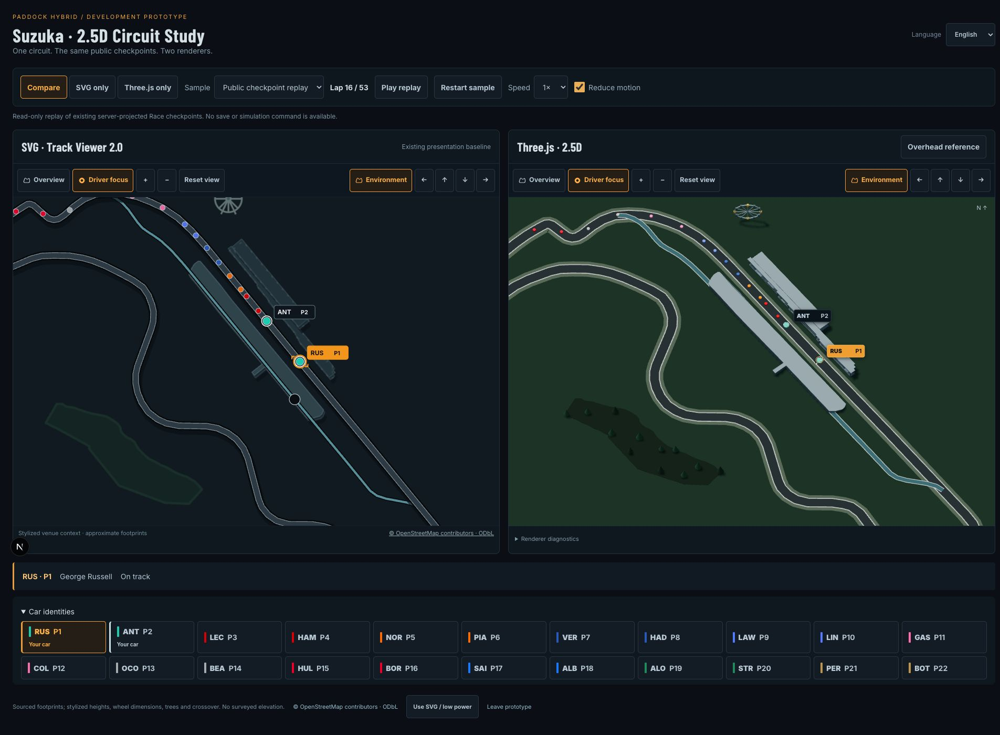

# UIX-B — SUZUKA THREE.JS 2.5D PROTOTYPE
## CODEX BUILDER HANDOFF

### Role

CODEX ACTED AS BUILDER. CODEX TESTER IS SEPARATE. NO INDEPENDENT ACCEPTANCE PERFORMED.

This is a completed, isolated experiment for Project Lead review. It does not certify the visual quality gate or authorize a production migration.

### Base Commit

`fdbc4509f8efd1dd3ed038f79707d5052bf652a2`

### Prototype Branch

`codex/uix-b-suzuka-threejs-poc`

### Final Commit

The full final SHA and push result are provided in the accompanying Builder handoff. Resolve the checked-out candidate with `git rev-parse HEAD`.

### Existing Track Viewer Audit

Inspected TrackMap, camera helpers/controls, environment rendering/geometry/data, motion, labels, circuit layouts, Suzuka geometry, pit lanes and the environment provenance document. The existing viewer provides the comparison renderer, source coordinates, canonical pit route, camera vocabulary, public MapRow contract, interpolation and detail tiers.

Inspected the supplied Suzuka overview and focus reference images. No new OpenArt study, bitmap texture or downloaded model was needed. The experiment was built in a clean sibling clone to preserve the user's existing dirty checkout.

### Three.js vs React Three Fiber Evaluation

The installed project uses React 19.3.0, Next.js 16.3.5 and TypeScript 6.0.3. React Three Fiber 9.8.1 was evaluated: its React peer range includes this React version. Its [installation guidance](https://r3f.docs.pmnd.rs/getting-started/installation) and [v9 migration guide](https://r3f.docs.pmnd.rs/tutorials/v9-migration-guide) support the React 19 generation.

Both approaches can run in a client component behind a lazy import. Direct Three requires explicit lifecycle/resource ownership; Fiber would add a reconciler, declarative scene bindings and another frame-loop abstraction. The existing imperative RaceMotion already supplies the animation contract. Registry unpacked sizes were approximately 20.4 MB for Three and 2.38 MB for Fiber; these are package footprints, not browser transfer sizes. Actual built chunks are measured below.

### Framework Selected and Why

Direct Three.js. One owned renderer, one demand-driven RAF and the existing RaceMotion fit this small experiment without another rendering framework. Reviewed the installed Next guides for client components, lazy loading and CSS before implementation. The renderer uses `next/dynamic` with `ssr: false` inside the isolated client comparison.

### Dependencies Added

- Runtime: `three@0.186.1`.
- Development: `@types/three@0.186.0`.

The official typings bring dev-only example dependencies, including `@dimforge/rapier3d-compat`, Tween, Stats/WebXR types, fflate and meshoptimizer. No physics engine is imported or integrated; Rapier is absent from the built browser chunks. No Fiber, Drei, full game engine, model loader or physics layer was added.

### Prototype Access / Preview Instructions

```sh
git fetch origin
git switch codex/uix-b-suzuka-threejs-poc
npm ci
ENABLE_SUZUKA_PROTOTYPE=1 npm run dev -- --webpack --hostname 127.0.0.1 --port 3218
```

Open [the local prototype](http://localhost:3218/dev/suzuka-viewer).

The server route requires both development mode and the exact flag value `1`. It returns 404 in production even when the flag is set. There is no normal application-navigation entry. Choose Compare, SVG only or Three.js only; select a public replay or an explicitly labelled stress fixture. Both panes share car selection, checkpoint, speed and reduced-motion input. Their camera controls can be compared independently.

### Original SVG Preservation

Production TrackMap, camera, environment, motion and label sources are unchanged. SVG remains the default everywhere. A prototype-only visibility wrapper suspends the comparison SVG when its pane is offscreen or the document is hidden.

WebGL preflight/initialization/render/context-loss failures fall back to the existing SVG. A manual low-power button also selects SVG. Retry mounts a fresh GPU canvas after context loss; a lazy-import error boundary still provides SVG.

### Shared Geometry / Data Contract

Existing normalized coordinates map uniformly to `(x - 0.5) × 1000` and `(y - 0.5) × 1000` on the horizontal plane. Vertex order, direction, start/finish offset and progression remain unchanged. Road subdivision stays on each original straight source segment; it does not fit a new curve or introduce shortcuts. Compact orientation applies the existing transform to track, pit and environment together.

Public rows retain only identity, public progress/status/rank, team colour, player identity, public route and route observations. No seed, RNG state, AI decision, private plan or authoritative Race input is shipped. The same prepared source path and pit sampler drive both renderers. Added height is presentation-only.

### Suzuka 2.5D Scene Architecture

Orthographic camera, original procedural meshes, hemisphere/directional lighting, bounded DPR, static shadows, shared token geometries/materials and instanced woodland. Scene construction is independent of replay checkpoints. Resource ownership explicitly disposes geometries, materials, instancing, shadow resources, render lists, renderer/context, observers and event listeners. Each effect owns a fresh canvas to handle React Strict Mode safely.

### Circuit Surface

Layered asphalt, bright boundaries and restrained shoulders follow the original centreline. The exact figure-eight intersection gets a modest schematic vertical treatment on the later source segment. The deck rises six world units; this is explicitly not surveyed elevation. The chequered start/finish uses the existing progression offset. No invented sponsor logos or corner kerb locations.

### Pit Lane

The existing canonical pit route is a separate blue-grey strip. Track, pit entry, service and exit sampling preserve the existing route contract and anchor relationships. The service fixture anchors the token at the canonical service point, rather than inventing a pit animation.

### Pit Building

Original extrusion of the existing OSM-derived footprint, roof and generic roof divisions. It represents a pit facility without claiming an accurate garage count or reconstruction.

### Grandstands

V1/V2 retain sourced footprints and confidence levels. Layered seating, compact canopies and supports add depth; heights and tiers are stylized. No individual spectators.

### Circuit Wheel

Static original rim, spokes, cabins and supports at the existing footprint centre. Wheel dimensions and orientation are schematic. It becomes easier to recognize in Focus than Overview.

### Terrain / Vegetation

Green ground and two sourced woodland areas. Deterministic grid jitter places trees only within those polygons and outside track/pit clearance corridors. Shared instanced trunks/crowns are HIGH detail decoration. No random trees, surveyed tree positions or invented topography.

### Geographic Placement / Licensing

Reuse the six existing OSM features: pit building `184422099`, V1 `184107052`, V2 `183394522`, wheel `184107083`, woodland `184103171` and `184252619`. Footprints, source references and LOW/MEDIUM/HIGH placement confidence remain unchanged. See [existing provenance](track-viewer-2-environment-provenance.md). The preview shows [OpenStreetMap contributor / ODbL attribution](https://www.openstreetmap.org/copyright).

All new meshes/materials are original. No commercial circuit models, game assets, satellite imagery or remote map textures. The UI explicitly labels heights, vegetation, wheel dimensions and crossover styling as approximations.

### Vehicle Markers

22 lightweight shared race tokens; selected amber ring, both player cars with a separate white ring and nose cue, lower-emphasis AI. Screen-space labels use the existing placement helper. Token anchors never move to resolve overlap. A separate accessible list selects every car. Retired cars leave the canvas but remain in the list; lapped status stays textual. Dense-field overlap remains deliberate and observable.

### Driver Focus Camera

Uses existing camera helpers and the selected public route position. Smooth settling with reduced-motion instant settlement. Changing the managed car moves Focus only in response to the player's selection. Retired selections return to Overview framing.

### Overview Camera

Default full-circuit framing includes pit and sourced non-forest landmarks. Default angle is 30 degrees from vertical with orthographic scale. An Overhead reference toggle supports shape comparison without modifying coordinates.

### Pan / Zoom / Reset

Bounded zoom 1–4, existing camera buttons, desktop drag and accessible directional controls. Touch can use the controls without a drag-only requirement. Reset settles at full-circuit zoom 1. Actual browser drag changed camera mode to manual while paused progress stayed 16; Reset restored zoom 1.0000 with the same 22 cars and progress.

### Race State Connection

**Fixture playback, not live saved-Career integration.** The offline generator uses the existing engine and public projection to export 12 checkpoints at laps 16–27 of a 53-lap Suzuka sample. Playback only interpolates these immutable public observations with existing RaceMotion. Neither renderer issues a simulation, save or network command.

Six additional variants deliberately stress dense positions, cars apart, pit service, a critical issue, retirement and lapping. They are clearly labelled presentation fixtures, not simulated outcomes or alternative Race v8 results. Critical metadata is a fixture annotation, not hidden telemetry. The generator's public-field whitelist and immutable replay are tested. Source data can be regenerated with `npx tsx scripts/generate-suzuka-prototype.ts`.

### Responsive Results

Actual in-app-browser viewport overrides were checked against document dimensions; all showed 22 cars at the same paused checkpoint and no horizontal overflow. Both renderers used the same source feature detail tier.

| Viewport | Shared detail | Comparison layout |
|---|---|---|
| 1280×720 | MEDIUM | Side by side; vertical page scroll |
| 1366×768 | MEDIUM | Side by side |
| 1536×864 | MEDIUM | Side by side |
| 1920×1080 | HIGH | Side by side |
| 2560×1440 | HIGH | Side by side |
| 3440×1440 | HIGH | Side by side |
| 768×1024 | MEDIUM | Stacked |
| 390×844 | LOW | Stacked; wrapping controls |
| 360×800 | LOW | Stacked; wrapping controls |

See [responsive observations](evidence/suzuka-threejs/responsive.json). Mobile/tablet screenshots are paired visible-pane captures: an offscreen WebGL surface is intentionally suspended, so a full-page compositor capture is not evidence of its visible render. These are desktop viewport studies, not tests on actual mobile GPUs. DPR is capped at 1.5, or 1.25 for narrow panes; shadows are disabled on narrow panes.

### Accessibility

Existing camera controls retained; native buttons with visible focus, pressed state, text status and an accessible car list with at least 44-pixel targets. Canvas is decorative to assistive technology. Selected/second-car rings and nose cues supplement colour. EN and Traditional Chinese prototype strings are centralized; game identities are unchanged. Actual language switching preserved selection and public progress. Reduced motion uses the OS preference or preview checkbox. Keyboard Enter on Focus/pan controls was checked. Full screen-reader and touch-device QA remain independent work.

### Performance Measurements

Observed on `Mac16,8` with 24 GiB RAM, desktop Chromium in the Codex in-app browser, development Webpack and DPR 1. Chrome also rendered the real scene. No exact GPU model or mobile hardware claim is made.

| Public replay | SVG mean CPU / max | Three mean CPU / max | Mean RAF interval, SVG / Three |
|---|---|---|---|
| 1×, 22 cars | 0.166 / 1.60 ms | 0.399 / 24.10 ms | 5.54 / 5.56 ms |
| 8×, 22 cars | 0.155 / 0.40 ms | 0.450 / 31.80 ms | 5.41 / 5.65 ms |

Both renderers reached exact final public progress 27. Three recorded 4,766 frames at 1× and 603 at 8×; SVG recorded 4,774 and 619. The RAF interval is instrumented preview timing, not a verified GPU FPS guarantee. CPU maxima include initial shader/setup work; measurements time CPU work/submission, not GPU completion.

- Measured scene: 127 draw calls, 11,464 triangles, 219 objects, 64 GPU geometries and three internal textures at the recorded overview. Responsive paused samples ranged from 60 calls at LOW to 132 at HIGH.
- Setup: 8.0–10.3 ms; effect start to first frame: 35.3–45.4 ms. One fresh warm development navigation reached its first GPU frame at 850.8 ms, including hydration/lazy loading. This is not a cold production benchmark.
- Paused idle frames stayed at 3 across the observation. Focused tests verify hidden/offscreen suspension, no hidden-wall-time catch-up, checkpoint scene reuse and disposal. Actual forced context loss removed GPU panels, showed SVG and rendered again on Retry.
- Production renderer async chunks total 586,896 minified bytes, or 149,081 bytes with local gzip (about 146 KiB). The fixture JSON is 157,733 raw bytes, separate from those chunks. No initial route manifest references the Three chunks. Build outputs are not committed.
- GPU timer queries, VRAM bytes, battery use, long-session heap stability and a real low-end hardware campaign were not measured. `preserveDrawingBuffer` supports screenshot review and should be reevaluated if adopted.

Raw evidence: [performance](evidence/suzuka-threejs/performance.json), [bundle](evidence/suzuka-threejs/bundle.json), [fallback](evidence/suzuka-threejs/fallback.json), [production guard](evidence/suzuka-threejs/production-guard.json).

### SVG vs Three.js Comparison

Three improves architectural depth, wheel silhouette, seating/roof structure and visible ground contact. Focus gives a stronger sense of a miniature venue. It also supports an intentional angled tactical view with an overhead geometry reference.

SVG remains clearer for the full field: brighter/larger markers against the ink background, simple road contrast and no GPU startup. Dense cars overlap in both renderers; the prototype solves selection through labels and the list, not altered anchors. The 3D terrain still looks sparse, and the wheel is small in Overview. A dramatic premium-quality improvement is not established by these captures.

Three's measured CPU submission cost is higher and adds about 146 KiB gzipped lazy renderer code. It also requires explicit canvas/context, shader, visibility, resource and projection handling. React Strict Mode initially exposed a reused-canvas context-loss failure; the fresh-canvas lifecycle fixes it and is regression-tested. The prototype's costs are isolated, but a production migration would still add maintenance work.

### Screenshot Evidence

Comparable geometry, public positions, selection and detail tiers; both panes are present in desktop comparisons. The angled projection intentionally differs from SVG; use the overhead reference for top-down shape review.



- [Overview, Full HD](evidence/suzuka-threejs/overview-1920x1080.png), [short laptop](evidence/suzuka-threejs/overview-1280x720.png), [overhead reference](evidence/suzuka-threejs/overhead-reference-1920x1080.png).
- [Dense 22-car field](evidence/suzuka-threejs/dense-1920x1080.png), [managed cars apart](evidence/suzuka-threejs/apart-1920x1080.png), [pit service](evidence/suzuka-threejs/pit-1920x1080.png), [second car / critical fixture](evidence/suzuka-threejs/critical-1920x1080.png).
- [Mobile Three](evidence/suzuka-threejs/overview-390x844.png) / [same mobile SVG](evidence/suzuka-threejs/overview-svg-390x844.png); [small mobile Three](evidence/suzuka-threejs/overview-360x800.png) / [same small mobile SVG](evidence/suzuka-threejs/overview-svg-360x800.png).
- [Context loss / SVG fallback](evidence/suzuka-threejs/context-loss-fallback-1920x1080.png), [Traditional Chinese](evidence/suzuka-threejs/zh-TW-1920x1080.png), [retired](evidence/suzuka-threejs/retired-1920x1080.png), [lapped](evidence/suzuka-threejs/lapped-1920x1080.png).

The evidence directory also includes all remaining requested viewport captures and matching observed data. These are actual browser renders, not reference/mockup images.

### Files Changed

- `src/app/dev/suzuka-viewer/page.tsx`: server gate and immutable public replay entry.
- `src/features/race/prototype/`: comparison UI, scene/model, GPU lifecycle, styles and replay JSON.
- `scripts/generate-suzuka-prototype.ts`: offline public-checkpoint export and labelled stress cases.
- EN / zh-TW `messages.json`: prototype strings only.
- `package.json`, `package-lock.json`: pinned Three and types.
- Four `tests/suzuka-*` files: focused regression coverage.
- This handoff and `docs/evidence/suzuka-threejs/`: review evidence.

### Tests Added

29 new tests: 14 model/scene/data/gate, seven lifecycle, five WebGL and three comparison tests. Coverage includes exact route sampling/transform, crossing styling, deterministic vegetation, public field whitelist, immutable data, resource disposal, Strict Mode fresh canvases, checkpoint reuse, pause/hidden/reduced motion, final interpolation draining, fallback paths, locale preservation and production guard.

Renderer doubles test lifecycle failures; real browser captures establish actual WebGL initialization/rendering. Neither substitutes for independent hardware testing.

### Builder Checks

**BUILDER-SIDE ONLY.** Commands actually run:

```sh
npx tsx scripts/generate-suzuka-prototype.ts
npm run typecheck
npm run lint
npx vitest run tests/suzuka-prototype.test.ts tests/suzuka-prototype-lifecycle.test.tsx tests/suzuka-webgl.test.ts tests/suzuka-prototype-comparison.test.tsx tests/track-viewer-2.test.tsx tests/viewer-motion.test.ts tests/viewer-live-motion.test.ts tests/race-v8-map.test.tsx tests/i18n.test.ts
npm run build -- --webpack
ENABLE_SUZUKA_PROTOTYPE=1 npm run start -- --hostname 127.0.0.1 --port 3219
curl -s -o /dev/null -w '%{http_code}\n' http://127.0.0.1:3219/dev/suzuka-viewer
git diff --check
```

Typecheck, lint, focused tests and build completed successfully. Focused result: **nine files, 177 tests passed** (29 new, 148 existing). Production request returned **404** with the flag enabled. Browser sanity covered actual initialization, selection, Focus/pan/reset, single/compare modes, replay at 1×/8×, responsive layout, language switching, reduced motion, forced context loss, Retry and manual SVG/low-power mode. No full regression, database run, formal tester verdict or Beta gameplay acceptance was performed.

### Gameplay / Simulation Changes

NONE. **RACE v8 SIMULATION AND GAMEPLAY CONTRACT UNCHANGED.** No simulation input, balance, RNG, persistence or gameplay source was modified. Offline fixture generation uses existing mechanics; browser playback is presentation-only.

### Backend / Database Changes

NONE. No new backend API. Schema changed: no. Migration added: no. Historical migrations changed: no. The development page is a guarded presentation entry, not a Race command endpoint.

### Known Risks

Overview marker contrast/size and dense-pack legibility need independent visual review. Angled landmark occlusion, token height styling and wheel prominence need art-direction review. Procedural scenery is intentionally sparse. Responsive desktop emulation does not establish mobile GPU suitability. Dev-only transitive typings packages add installation weight. Browser GPU limits, battery use and long-session memory stability remain unmeasured. Saved-Career integration is deliberately absent.

### What Would Be Needed for Production Adoption

Project Lead approval of the visual direction; independent tester review of geometry/pit fidelity, both managed cars, label/marker legibility, keyboard/screen-reader behavior, reduced motion, context loss, repeated mount/resize cleanup, and actual ordinary/low-end/mobile hardware. Measure GPU completion, VRAM/battery and cold production loading. Assess batching, marker contrast, scenery composition and screenshot-buffer cost. Then scope a separate approved public-projection integration; retain SVG and the information boundary. No adoption work is included here.

Three's [renderer documentation](https://threejs.org/docs/pages/WebGLRenderer.html), [orthographic camera documentation](https://threejs.org/docs/pages/OrthographicCamera.html) and [resource cleanup guidance](https://threejs.org/manual/pages/cleanup.html) informed the implementation.

### Recommended Technology Decision

**THREE.JS BENEFITS ARE UNCERTAIN — RECOMMEND SIDE-BY-SIDE REVIEW**

This is a Builder recommendation. The experiment shows real spatial advantages and exposes the costs, but does not demonstrate that it should replace the accepted SVG presentation. Project Lead acceptance is separate.

### Git Status

Separate experimental branch from the verified base. Existing UIX-B history preserved. No merge or history rewrite. Full commit SHA, clean-tree verification and push result are recorded in the accompanying final handoff. Generated agent files, build output and temporary probes are excluded.

### Final Builder Status

**SUZUKA THREE.JS PROTOTYPE COMPLETE — READY FOR PROJECT LEAD REVIEW**
