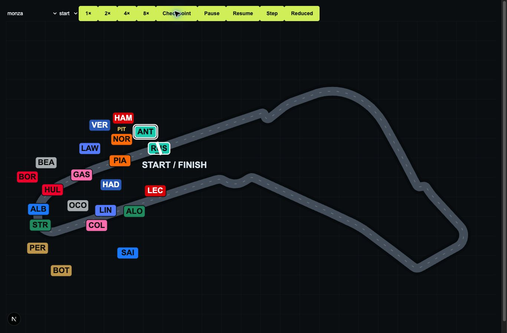

# Codex Builder Report — Track Map Live Timing Motion & Marker Polish

## Status

Implementation complete and ready for independent QA.

## Starting Main

`2bfd8e3b3ed4cc792ec9e0397f2107393d7e42a8` — Content Expansion Pass B — Full 2026 Calendar, Circuits & Climate. Fetched, switched to main, fast-forwarded and confirmed a clean tree. No open competing PR; existing Claude branch concerned the previous weather/fuel closure task.

## Branch

`codex/track-map-live-timing-polish`

## Problem Diagnosis

Linear checkpoint interpolation gave straights and corners almost identical visual velocity. XY-only collision detection confused nearby track branches, while five offsets spaced only five SVG units apart could not separate the field. Only promoted drivers had detached identity tags.

## Reference Study

### matteocelani/f1-telemetry

Examined the [README](https://github.com/matteocelani/f1-telemetry) and [useTrackMap hook](https://github.com/matteocelani/f1-telemetry/blob/main/apps/frontend/src/modules/timing/hooks/useTrackMap.ts): curvature weighting, micro-sector anchors and direct SVG updates. Adapted the curvature/presentation-clock principle. Rejected feed integration, extrapolation and frame-dependent catch-up lerps. MIT licence inspected; no implementation copied.

### adn8naiagent/F1ReplayTiming

Examined the [README](https://github.com/adn8naiagent/F1ReplayTiming) and [replay socket hook](https://github.com/adn8naiagent/F1ReplayTiming/blob/main/frontend/src/hooks/useReplaySocket.ts). Its documented roughly 0.5-second positional updates illustrate why renderer frequency must differ from input frequency. Retained local pause/speed controls, without importing GPS, socket seeking or network architecture. README states personal/non-commercial use; no code/assets reused.

### siddoboi/f1-telemetry-dashboard

Examined [App.jsx](https://github.com/siddoboi/f1-telemetry-dashboard/blob/main/frontend/src/App.jsx), TrackMapView and MIT licence. The app separates arrival timestamps from a RAF interpolation loop and accounts for playback pacing. Adapted only that separation; rejected its telemetry/anomaly backend, network pacing and per-frame React state approach. No code copied.

### OpenF1

Read [API documentation](https://openf1.org/docs/), including approximately 3.7Hz telemetry. Lesson: sparse authoritative data does not require sparse rendering. No API calls, subscriptions, telemetry or additional browser data introduced.

## Motion Architecture

`prepareVisualSpeed` samples 512 equally spaced arc-length positions. A local heading window estimates bend angle, followed by periodic triangular smoothing. Bounded inverse velocity gives a maximum 2.2:1 straight/corner contrast. Integrated normalized inverse velocity forms a strictly increasing lap-time table; binary inverse lookup maps elapsed time back to distance.

Every car uses the **same** monotonic map, with linear interpolation between its mapped start and committed target. This preserves relative order whenever both endpoints preserve order. Absolute lap numbers remain outside the periodic lookup; negative grid progress, start/finish crossings and fractional/multiple-lap deltas work. Completion assigns the exact target explicitly. Reconciliation starts from the last drawn position; no extrapolation or drift.

Green uses full contrast; VSC/SC use 30% contrast and the existing 1.4×/1.8× checkpoint-duration multipliers. Profile choice is frozen per checkpoint to avoid a control-setting jump. Speed changes retain elapsed fraction; suspension still caps a frame delta at 50ms.

## Standing Start

When the initial field is at non-positive grid progress, the first movement has a short 12%-interval acceleration ramp. It is common to the field, preserves endpoints/order and is not repeated each lap. Existing saved races already in progress do not relaunch.

## Overtake Presentation

Mapped endpoint interpolation permits one relative crossing when a committed target reverses order. If both endpoint orders agree, affine interpolation in the shared time coordinate cannot reverse them. No pass timing, future checkpoint or hidden strategy is requested. Lateral separation does not alter longitudinal progress.

## Pack Detection

Circular along-track distance is the primary gate, including cars across start/finish and lapped cars physically nearby. Adjacent neighbours form local components; pair collision checks remain capped to 5% of a lap so a chain cannot join remote hairpin/crossover branches. Upright badge bounds are the secondary screen-space check.

## Marker Separation

Greedy deterministic allocation puts selected/player priority first, then stable IDs. Candidate lane count grows with field size. Spacing uses the badge's projected support along the local normal, plus a gap. Previous offsets receive hysteresis; oversized obsolete offsets can compact. Leaving a pack has a 350ms hold followed by exponential return. A 45ms lateral time constant reduces chasing at accelerated playback. Local normals use a short symmetric geometry window instead of abrupt raw vertex tangents.

Bounds and the start/finish text reserve constrain target positions. All displacement remains normal to the path. Exact co-location tests cover up to 22 cars. Where geometry/view bounds leave no collision-free lane, the solver preserves a remembered offset rather than fabricating longitudinal gaps; extreme moving packs can briefly overlap during transitions. This is an explicit independent visual-QA risk, not a claim of perfect collision elimination.

## Integrated Driver Marker

All visible cars use a 44×24 rounded team-colour badge with their abbreviation inside. Near-black/white text is selected by contrast. Selected car: white outer ring; other player car: white border and underline; AI: compact dark border. Retired cars freeze at their last drawn location, retain identity, fade and show a small X. PIT keeps the existing translated compact flag. A container ResizeObserver adjusts badge scale for narrow maps; it does not run layout measurements per frame.

## Removed Old Label Behavior

The ordinary detached label groups and connector paths are removed from TrackMap. Priority now controls allocation and drawing order, not whether a driver has an identity. The legacy `labels.ts` placement exports/tests remain; TrackMap uses only its priority constants, path-length utility and start/finish reserve helper. This is not a claim that all old label helper code was deleted.

## Circuit Verification

Chrome fixture inspection used the production TrackMap component and the actual pinned layouts:

- Monza: standing grid, launch, straight/corner contrast and frame sample.
- Monaco: compressed SC fixture and dense bends; transient packing overlap remains the hardest visual case.
- Suzuka: flowing geometry and crossover; permanent real-geometry test rejects cross-branch repulsion.
- Spa: long segments, bends and settled pack readability.
- Jeddah: narrow flowing circuit and integrated badges.
- Baku and Las Vegas: passing fixture, technical sections and long straights.
- Madrid: geometry, speed changes, mid-checkpoint pause/resume and reduced-motion step.

## Standing Start Stress

22 integrated identities inspected, selected/player hierarchy visible. Deterministic allocation avoids the former five-lane reuse. Unit tests also exercise 22 exactly co-located markers; no duplicate lane assignment in that feasible case.

## Safety Car / Dense Pack Stress

Monaco used a 22-car compressed public-row fixture with SC cadence. No Race simulation changes or artificial SC deployment in persisted data. Initial 120ms lateral smoothing was too slow; reduced to 45ms after browser inspection. Very compressed moving packs can still temporarily overlap at corners; settled placement and selected-driver visibility were inspected.

## Hairpin / Crossover Validation

Permanent synthetic same-XY/distant-progress test, real Suzuka opposite-branch test, start/finish wrap test and lapped-car proximity test. Pack solver never writes progress. Reserve/return-to-centre, retirement freeze and input immutability also covered.

## Playback Controls

1×/2×/4×/8× exercised in the browser. Madrid samples progressed 0.6611 → 1.0202 → 1.3 during speed changes, without reversal. Mid-checkpoint pause held exactly 1.394541191809606 across observations; resume advanced to 1.444945637734652. Reduced-motion Step reached the committed 3.3 target. Keyboard Enter selected another driver.

Step/reduced-motion browser controls and existing PlaybackController unit tests cover settling, pause, late responses, speed changes, strategic auto-pause and seek cadence. **Next Strategic Event was verified by existing controller tests, not by clicking the full Career page in this browser fixture.** The controller and network code are unchanged.

## Performance

One RAF loop retained; direct SVG transforms/data attributes only per frame, no React frame state. Geometry/time tables are memoized per layout. Marker sizes are numeric; no per-car DOM layout reads. Final representative Monza run: **494 frames, mean work 0.352ms, max work 1.700ms, mean interval 5.533ms, max interval 6.300ms** on this machine. This is development instrumentation, not a portable FPS guarantee. A background-window sample was excluded from cadence conclusions.

## Information Boundary

Only existing MapRow/public checkpoint fields plus geometry. No hidden Race state, future lap times, commands, RNG, incidents, weather truth or car performance added. No additional polling.

## Persistence / Database

schema changed: **no**

migration added: **no**

persistent Race format changed: **no**

## i18n / Accessibility

No new player-facing copy. Existing EN/zh-TW keys serve map, position, status, player and PIT labels; abbreviations remain game data. Click, Enter/Space, ARIA label/pressed state, focus target, player hierarchy and retired/PIT identity have a mounted component regression.

## Tests

Commands actually run:

- `npx vitest run tests/viewer-live-motion.test.ts tests/viewer-motion.test.ts tests/viewer-labels.test.tsx tests/grid.test.tsx` — 149 tests at that checkpoint.
- `npx vitest run tests/viewer-live-motion.test.ts tests/viewer-markers.test.tsx` — 39 tests after reserve coverage.
- `npm test` — **890 tests passed across 45 files**.
- `npm run typecheck` — completed successfully.
- `npm run lint` — completed successfully.
- `npm run build` — completed successfully.
- `git diff --check` — clean.

No PostgreSQL campaign: no persistence boundary changed. Next's temporary dev-route type cache initially prevented build after probe removal; deleting that generated dev cache resolved the stale import. Temporary browser route and auto-generated AGENTS/CLAUDE files were removed.

## Browser Verification

Chrome, 1366×900, 768×900 and 576×900. Public-row fixtures exercised 22-car start, green pack, committed pass, compressed SC, eight layouts, speed changes, pause/resume, Step/reduced motion and keyboard selection. The fixture was removed before build/commit; no test route ships. These are focused component browser checks, not a full Career gameplay acceptance campaign.

## Preserved Systems

Race engine, Racecraft, tyres, fuel, ERS, pits, incidents, weather, AI strategy, championship and Career snapshots unchanged. Shared TrackMap is also used by Practice/Qualifying; hidden garage filtering remains.

## Deferred / Out of Scope

Verified pit-lane geometry, true GPS simulation and Phase 17 Car Development not started. No network feed or external packages added.

## QA Handoff

Prioritize dense moving Monaco/SC packs and transient overlaps; narrow maps inside the full Race-page columns; exact endpoint/order preservation through early checkpoints; pause/reduced-motion preference changes; full-page Next Strategic Event; retirement and hidden Practice cars; start/finish crossing with PIT flags. Confirm live motion feel at 8× independently. No formal acceptance verdict supplied.

## Files Changed

- `src/features/race/viewer/speed-profile.ts`: geometry-derived periodic visual-time map.
- `src/features/race/viewer/motion.ts`: shared mapped interpolation and one-time launch.
- `src/features/race/viewer/marker-packs.ts`: local packs, lateral memory, bounds/reserve and text contrast.
- `src/features/race/viewer/track-map.tsx`: shared renderer integration, integrated responsive badges.
- `tests/viewer-live-motion.test.ts`, `tests/viewer-markers.test.tsx`: motion/packing/accessibility regressions.
- `tests/viewer-labels.test.tsx`, `tests/grid.test.tsx`: updated integrated identity expectations.
- This report and browser evidence image.

## Git

branch: `codex/track-map-live-timing-polish`

Exact implementation commit and confirmed push status are in the accompanying handoff. No merge; no Phase 17 work.
